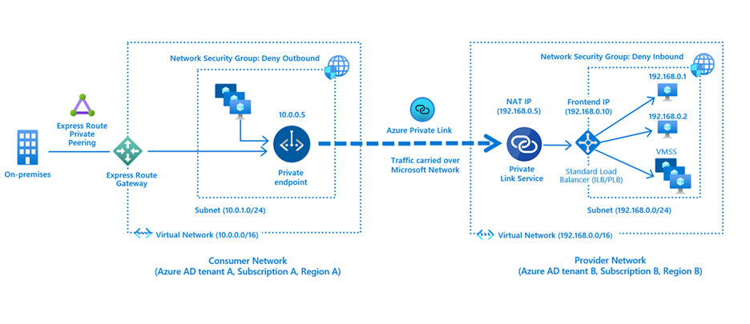
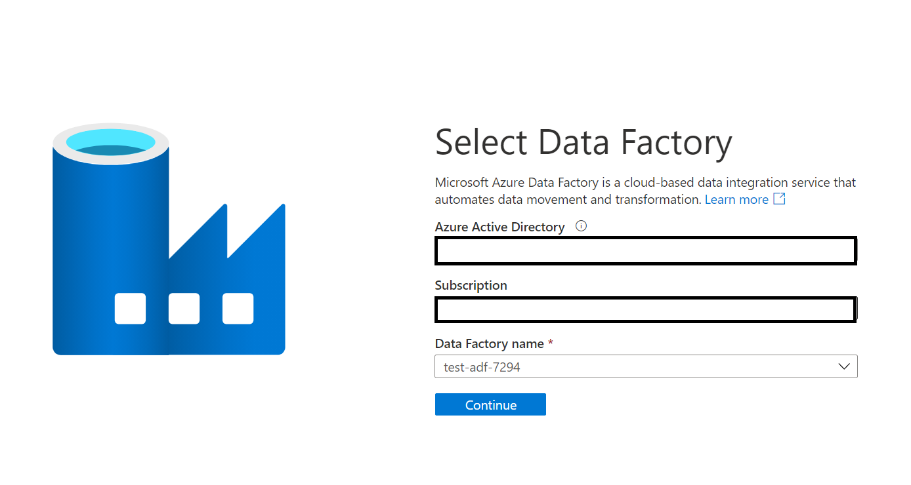
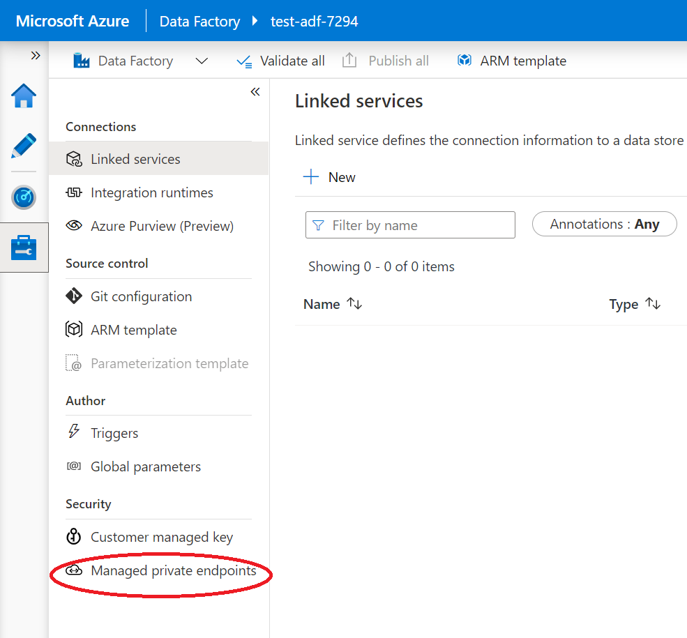
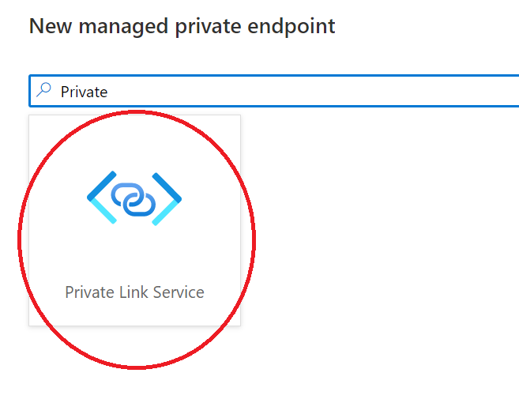
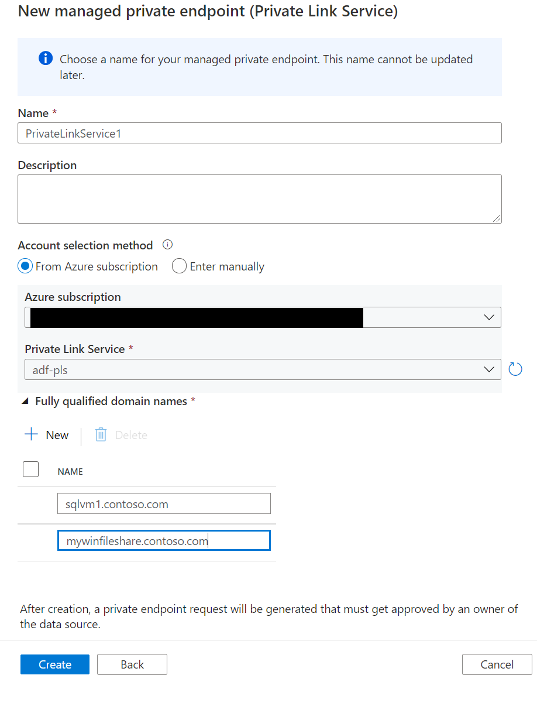

# Securely connect to an External Endpoint from Azure

# Introduction
Azure’s [Private Link](https://docs.microsoft.com/en-us/azure/private-link/private-link-overview) enables you to securely access Azure PaaS and Partner resources over a private endpoint (PE) in your own virtual network (VNET).  The private access is resource specific as opposed to service specific and protects against data exfiltration in that connectivity can be initiated in only a single direction.

# IaaS Connectivity
In addition to being able to connect to PaaS resources, you can also securely connect to Azure Virtual Machines (IaaS) that are fronted by a Standard Internal Load Balancer as shown in the figure below:

The Private Link Service (PLS) as shown in the Provider Network performs [Destination NAT](https://en.wikipedia.org/wiki/Network_address_translation#DNAT) which prevents IP overlapping issues between the Consumer and Provider VNETs in Azure.  From the perspective of the Provider Network, the source IP is going to be the NAT-ted IP (192.168.0.5 from the figure above).  The Provider can determine the original source of the connection by looking at the TCP Proxy V2 header.  Details for this is outside the scope of this article but more information on how one can get the source IP can be found [here](https://docs.microsoft.com/en-us/azure/private-link/private-link-service-overview#getting-connection-information-using-tcp-proxy-v2).

# Connectivity from Managed/Secure VNET to a server in another VNET or On-Premises server
If you want to connect from a private/managed subnet to an on-premise server or a server in another VNET as shown in the figure below which shows connectivity from Azure Data Factory (ADF) Managed Virtual Network to an on-premise SQL Server


# Forwarding Solution:

## Prerequisites
   * Download code from this repository locally:  
     ```  
     git clone https://github.com/sajitsasi/adf-pipeline.git
     cd adf-pipeline
     ```  
   * Get the IP and Port of the Destination host to which you want traffic
     forwarded to.  For example, you have an SQL server installed with 
     IP 10.100.3.4, then the values would be:
     ```  
     DEST_IP="10.100.3.4"
     DEST_PORT="1433"
     ```  

## Implement Forwarding Solution
### 1. The following values will be used for this solution:
   * Resource Group: ```az-adf-fwd-rg```
   * Azure Region: ```East US```
   * Forwarding VNET Name: ```az-adf-fwd-vnet```
   * Forwarding VNET Address Space: ```10.100.0.0/20```
   * Subnets in Forwarding VNET:
     * Name: ```adf-fwd-fe-subnet```  Address Space: ```10.100.0.0/24```
     * Name: ```adf-fwd-be-subnet```  Address Space: ```10.100.1.0/24```
     * Name: ```adf-fwd-pls-subnet```  Address Space: ```10.100.2.0/24```
     * Name: ```adf-fwd-vm-subnet```  Address Space: ```10.100.3.0/24```
     * Name: ```adf-fwd-bast-subnet```  Address Space: ```10.100.4.0/24``` (_optional_)
   * NSG for blocking external traffic (_optional_): ```adf-fwd-vm-nsg```
   * Bastion VM for external access (_optional_): ```bastionvm```
   * Standard Internal Load Balancer: ```ADFFwdILB```
   * Forwarding VM name: ```fwdvm[#]```
   * Forwarding VM NIC: ```fwdvm[#]nic[RANDOM #]```
   * Backend/Destination server IPs and services:
     The following table shows the configuration that will be passed to the
     port forwarding VM. The `FE Port` references the port on which the
     port forwarding VM listens while the `BE Port` references the port
     on which the destination server listens.
     | Server     | Service    | FE Port | BE Port  |
     |------------|------------|---------|----------|
     | 10.100.3.4 | SQL        | 1433    |   1433   |
     | 10.100.3.4 | File Share | 445     |   445    |
     | 10.100.3.5 | SQL        | 1434    |   1433   |

### 2. Connect to your subscription
   #### Run the following command  
   ```
     az login
   ```  
   #### List subscriptions available if you have more than one Azure subscription:  
   ```
     az account list --all
   ```
   #### Specify the subscription you want to use:  
   ```
     az account set --subscription <subscription_id>
   ```  

### 3. Create a Resource Group  
   ```
   az group create --name az-adf-fwd-rg --location eastus
   ```  

### 4. Create a VNET and subnets  

   #### Create VNET and Frontend subnet
   ```
   az network vnet create \
     -g az-adf-fwd-rg \
     -n az-adf-fwd-vnet \
     --address-prefixes 10.100.0.0/20 \
     --subnet-name adf-fwd-fe-subnet \
     --subnet-prefixes 10.100.0.0/24 \
     --location eastus
   ```  

   #### Create Backend subnet
   ``` 
   az network vnet subnet create \
     -g az-adf-fwd-rg \
     --vnet-name az-adf-fwd-vnet \
     -n adf-fwd-be-subnet \
     --address-prefix 10.100.1.0/24 
   ```  
   #### Create PLS subnet
   ``` 
   az network vnet subnet create \
     -g az-adf-fwd-rg \
     --vnet-name az-adf-fwd-vnet \
     -n adf-fwd-pls-subnet \
     --address-prefix 10.100.2.0/24 
   ```  
     
   #### Disable PLS Network Policies
   ```  
   az network vnet subnet update \
     -g az-adf-fwd-rg \
     -n pls-subnet \
     --vnet-name az-adf-fwd-vnet \
     --disable-private-link-service-network-policies true
   ```  

   #### Create VM subnet
   ``` 
   az network vnet subnet create \
     -g az-adf-fwd-rg \
     --vnet-name az-adf-fwd-vnet \
     -n adf-fwd-vm-subnet \
     --address-prefix 10.100.3.0/24 
   ```  
   
   #### Create Bastion subnet (_Optional * use if you only want to externally connect_)
   ``` 
   az network vnet subnet create \
     -g az-adf-fwd-rg \
     --vnet-name az-adf-fwd-vnet \
     -n adf-fwd-bast-subnet \
     --address-prefix 10.100.4.0/24 
   ```  

### 5. Create an NSG (_Optional use if you only want to externally connect_)  
   #### Create NSG
   ```
   az network nsg create -g az--adf-fwd-rg --name adf-fwd-vm-nsg
   ```
   #### Create NSG Rule for SSH Access
   ```  
   ALLOWED_IP_ADDRESS="$(curl ifconfig.me)/32"
   az network nsg rule create \
     -g az-adf-fwd-rg \
     --nsg-name adf-fwd-vm-nsg \
     --name AllowSSH \
     --direction inbound \
     --source-address-prefix ${ALLOWED_IP_ADDRESS} \
     --destination-port-range 22 \
     --access allow \
     --priority 500 \
     --protocol Tcp
   ```  

   #### Assign NSG to Bastion subnet
   ```  
   az network vnet subnet update \
     -g az-adf-fwd-rg \
     -n adf-fwd-bast-subnet \
     --vnet-name az-adf-fwd-vnet \
     --network-security-group adf-fwd-vm-nsg
   ```  

   #### Create Bastion VM
   ```  
   az vm create \
     -g az-adf-fwd-rg \
     --image UbuntuLTS \
     --admin-user azureuser \
     --generate-ssh-keys \
     --vnet-name az-adf-fwd-vnet \
     --subnet adf-fwd-bast-subnet
   ```  


### 6. Standard Internal Load Balancer
   #### Create Load Balancer
   ```  
   az network lb create \
     -g az-adf-fwd-rg \
     --name ADFFWDILB \
     --sku standard \
     --vnet-name az-adf-fwd-vnet \
     --subnet adf-fwd-fe-subnet \
     --frontend-ip-name FrontEnd \
     --backend-pool-name bepool
   ```  

   #### Create a health probe to monitor the health of VMs using port 22  
   ```  
   az network lb probe create \
     -g az-adf-fwd-rg \
     --lb-name ADFFWDILB \
     --name SSHProbe \
     --protocol tcp \
     --port 22
   ```

   #### Create an LB rule to forward SQL packets on 1433 to forwarding VM on 1433
   ```  
   az network lb rule create \
     -g az-adf-fwd-rg \
     --lb-name ADFFWDILB \
     --name OnPremSQL \
     --protocol tcp \
     --frontend-port 1433 \
     --backend-port 1433 \
     --frontend-ip-name FrontEnd \
     --backend-pool-name bepool \
     --probe-name SSHProbe
   ```  

   #### Create an LB rule to forward (SQL) packets on 1434 to forwarding VM on 1434
   ```  
   az network lb rule create \
     -g az-adf-fwd-rg \
     --lb-name ADFFWDILB \
     --name OnPremSQL \
     --protocol tcp \
     --frontend-port 1434 \
     --backend-port 1434 \
     --frontend-ip-name FrontEnd \
     --backend-pool-name bepool \
     --probe-name SSHProbe
   ```  

   #### Create an LB rule to forward File Share packets on 445 to forwarding VM on 445
   ```  
   az network lb rule create \
     -g az-adf-fwd-rg \
     --lb-name ADFFWDILB \
     --name OnPremSQL \
     --protocol tcp \
     --frontend-port 445 \
     --backend-port 445 \
     --frontend-ip-name FrontEnd \
     --backend-pool-name bepool \
     --probe-name SSHProbe
   ```  

   #### Get ILB Resource ID
   ```  
   FWD_ILB=$(az network lb show -g az-adf-fwd-rg -n ADFFWDILB --query frontendIpConfigurations[0].id -o tsv)
   ```  
### 7. Create Private Link Service to ILB
   ```  
   PLS_ID=$(
      az network private-link-service create \
        -g az-adf-fwd-rg \
        -n pls2fwdilb \
        --vnet-name az-adf-fwd-vnet \
        --subnet adf-fwd-pls-subnet \
        --lb-frontend-ip-configs ${FWD_ILB} \
        -l eastus \
        --query id \
        -o tsv)
   ```  

### 8. Create NICs for VMs
   ```  
   NIC1_NAME=fwdvm1nic${RANDOM}
      az network nic create \
        -g az-adf-fwd-rg \
        -n ${NIC_NAME} \
        --vnet-name az-adf-fwd-vnet \
        --subnet adf-fwd-be-subnet
   ```  

### 9. Create backend forwarding Linux VM  
**Note: Make sure you're running this from where the cloud_init.yaml file exists**
   ```  
   az vm create \
     -g az-adf-fwd-rg \
     --name natvm1 \
     --image UbuntuLTS \
     --admin-user azureuser \
     --generate-ssh-keys \
     --nics ${NIC1_NAME} \
     --public-ip-address "" \
     --custom-data ./cloud_init.yaml
   ```  


### 10. Add NIC to LB
   ```  
   az network nic ip-config address-pool add \
     --address-pool bepool \
     --ip-config-name ipconfig1 \
     --nic-name ${NIC1_NAME} \
     -g az-adf-fwd-rg \
     --lb-name ADFFWDILB
   ```  

### 11. Print output variables
These are variables to use when wanting to connect to the PLS, or the Bastion VM
  #### Print PLS Resource ID to use for connection to this PLS
  ```  
    echo "PLS Resource ID is ${PLS_ID}"
  ```  

  #### Print Bastion VM Public IP (_Optional_)
  ```  
    echo "Bastion Public IP is: $(az vm show -d -g az-adf-fwd-rg -n bastionvm --query publicIps -o tsv)"
  ```  

### 12. Creating Forwarding Rule to Endpoint
Run command on remote FWD VM to create forwarding rule to destination IP
and port (```$DEST_IP``` and ```$DEST_PORT``` from Prerequisites).

  #### Following is a command to forward SQL Ports
  ```  
    az vm run-command invoke --command-id RunShellScript -g az-adf-fwd-rg -n fwdvm1 --scripts "/usr/local/bin/ip_fwd.sh -i eth0 -f 1433 -a 10.100.3.4 -b 1433"
  ```  

  #### Following is a command to forward Windows File Share port
  ```  
    az vm run-command invoke --command-id RunShellScript -g az-adf-fwd-rg -n fwdvm1 --scripts "/usr/local/bin/ip_fwd.sh -i eth0 -f 445 -a 10.100.3.4 -b 445"
  ```  

  #### When you have multiple SQL servers, you want to use a different frontend port to forward to the new server.  Here's an example of another SQL server with ```DEST_IP=10.100.3.5``` but listening on 1433. This example uses a frontend port of 1434:
  ```  
    az vm run-command invoke --command-id RunShellScript -g az-adf-fwd-rg -n fwdvm1 --scripts "/usr/local/bin/ip_fwd.sh -i eth0 -f 1434 -a 10.100.3.5 -b 1433"
  ```  

 ### 13. Setup connectivity in ADF
 This will setup connectivity from ADF to the Private Link Service created in the Azure subscription
   1. Go to the [Azure Portal](https://portal.azure.com)  
   2. From the center search, search for "Data Factories" and click on the 
     "Data Factories" option  
   3. Select the "Create" option and fill data:  
      * Fill in the appropriate information in the Basics tab
      * Choose "Configure Git Later" in the Git Configuration tab as shown below:
          
      * Choose "Enable Managed Virtual Network on the default AutoResolveIntengrationRuntime"  in the Networking tab as shown below:
          
      * Click on "Review + Create" and then click on "Create" when done  
   4. Now go to [Azure ADF](https://adf.azure.com)  
   5. Choose your AAD, Subscription, and enter your Data Factory Name that you just created and click on Continue
        
   6. On the Data Factory screen, click on the "Manage" icon as shown in the figure below:
          
   7. From the Manage page, select the "Managed Private Endpoints" as shown in the figure below:
        
   8. Click on "New" from the "Managed Private Endpoints" page as shown below:
        
   9. In the search, type "Private" as shown below:  
        
   10. Enter the information as shown in the diagram below.  **When entering the Fully Qualified Domain Names (FQDN), understand that the values need to be entered for ALL services you want ADF to access.**  The FQDN is local to the ADF VNET and doesn't need to match any actual FQDN that you might have assigned to your servers.  The different FQDNs of the multiple servers all translate to a **single** Private Endpoint IP in the local ADF VNET which is connected to the PLS created earlier. Click on "Create" once everything is entered.
        
      
         
       
       
